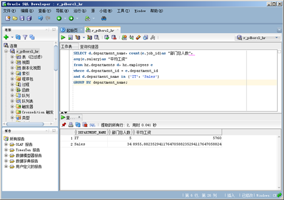
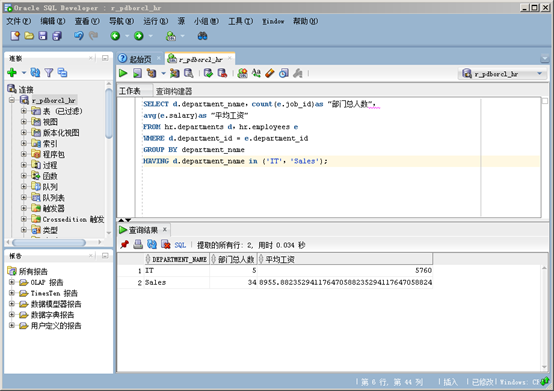
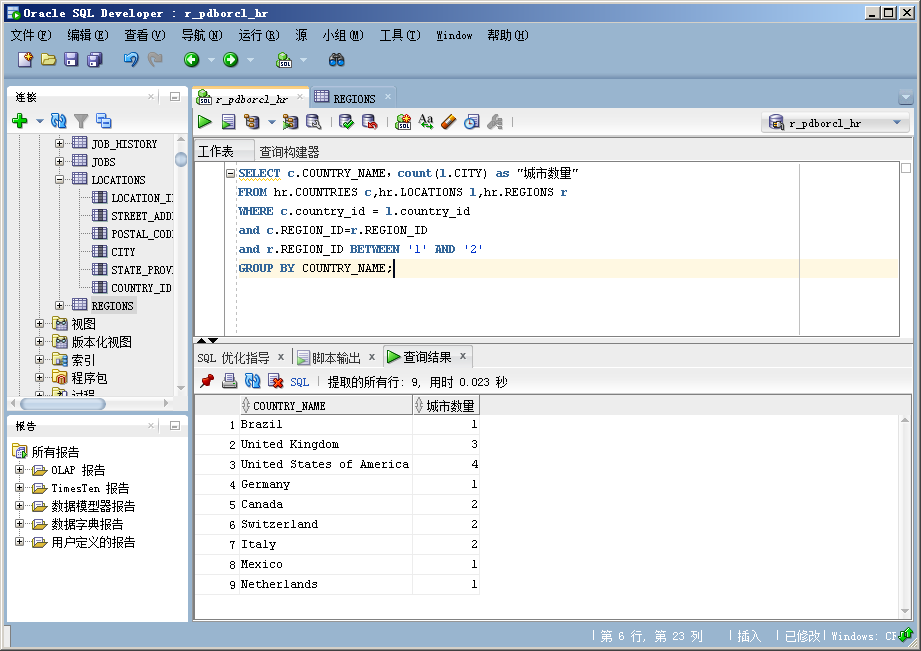

## 实验一：分析SQL执行计划，执行SQL语句的优化指导
# 实验内容：

对Oracle12c中的HR人力资源管理系统中的表进行查询与分析。 
首先运行和分析教材中的样例：本训练任务目的是查询两个部门('IT'和'Sales')的部门总人数和平均工资，以下两个查询的结果是一样的。但效率不相同。 
 
 
由图，使用第二张图片中的查询速度更快，查询资料后了解到 ，where主要过滤行，而having主要过滤分组，简而言之，having在where分类之后再次过滤，使得查询效率提升，查询速度变快。 
 
并且，在我们使用sql优化工具后，系统并没有给出优化指导。 
设计自己的查询语句，并作相应的分析，查询语句不能太简单。 
 
在我的查询语句中，，我想查询地区ID在1和2之间的国家名称以及国家的城市数量，使用了三张表COUNTRIES LOCATIONS REGIONS。 
