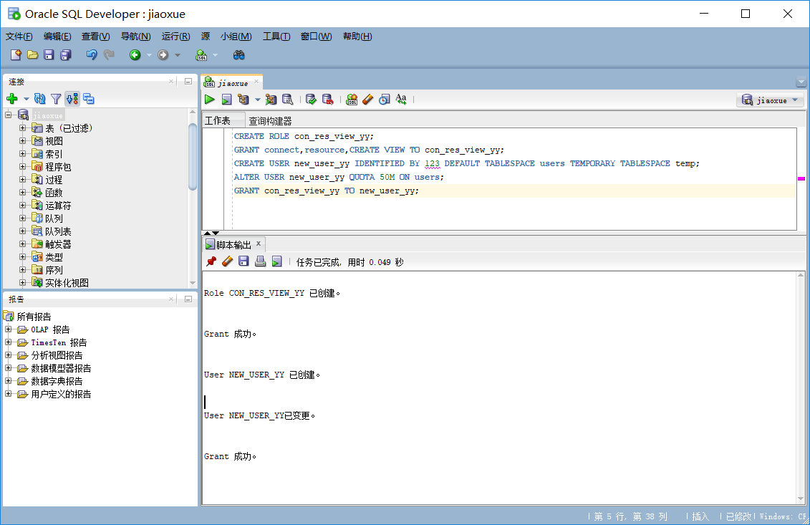

# 实验2：用户及权限管理
## 实验目的：

掌握用户管理、角色管理、权根维护与分配的能力，掌握用户之间共享对象的操作技能。
## 实验内容：

Oracle有一个开发者角色resource，可以创建表、过程、触发器等对象，但是不能创建视图。本训练要求：

    在pdborcl插接式数据中创建一个新的本地角色con_res_view_yy，该角色包含connect和resource角色，
    同时也包含CREATE VIEW权限，这样任何拥有con_res_view_yy的用户就同时拥有这三种权限。
    创建角色之后，再创建用户new_user_yy，给用户分配表空间，设置限额为50M，授予con_res_view角色。
    最后测试：用新用户new_user_yy连接数据库、创建表，插入数据，创建视图，查询表和视图的数据。
## 实验步骤   
第1步：以system登录到pdborcl，创建角色con_res_view_yy和用户new_user_yy，并授权和分配空间： 

第2步：新用户new_user_yy连接到pdborcl，创建表mytable和视图myview，插入数据，最后将myview的SELECT对象权限授予hr用户。 

第3步：用户hr连接到pdborcl，查询new_user_yy授予它的视图myview。 

## 实验心得
    在本次实验中，我尝试创建了本地角色和一个用户，并且授予了权限和空间，在操作中我了解到权限对于数据库的重要性，
    每个用户都应该做自己的事情而不应该去影响其他的用户的操作；但是在操作中需要的时候也可以给予用户权限来获得访问
    、修改的权力，数据库是一张管理的井井有条的网，每个人的工作都是通过不同的权限来分配的。
