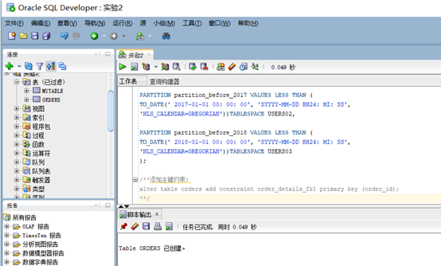

# 实验3：创建分区表 

## 实验目的：

掌握分区表的创建方法，掌握各种分区方式的使用场景。

## 实验内容：
- 本实验使用3个表空间：USERS,USERS02,USERS03。在表空间中创建两张表：订单表(orders)与订单详表(order_details)。
- 使用**你自己的账号创建本实验的表**，表创建在上述3个分区，自定义分区策略。
- 你需要使用system用户给你自己的账号分配上述分区的使用权限。你需要使用system用户给你的用户分配可以查询执行计划的权限。
- 表创建成功后，插入数据，数据能并平均分布到各个分区。每个表的数据都应该大于1万行，对表进行联合查询。
- 写出插入数据的语句和查询数据的语句，并分析语句的执行计划。
- 进行分区与不分区的对比实验。

## 实验步骤
### 1、创建表

用户名：NEW_USER_YY; 设置主表主键 order_id, 从表外键 order_id; 
主表的分区策略是按照日期范围--2015，2016，2017，分别对应分区USERS, USERS02,USERS03。
 在主表orders和从表order_details之间建立引用分区 在NEW_USER_YY用户中创建两个表：orders
 （订单表）和order_details（订单详表），两个表通过列order_id建立主外键关联。orders表按范
 围分区进行存储，order_details使用引用分区进行存储。 
 创建orders表的语句是： <br>
 

  创建orders_details表的语句是： <br>
  
 
### 2、插入万条数据
order插入数据（重复插入3个不同的数据，日期年份应该分别为2015、2016、2017）： <br>


主表创建序列 SEQ_ID <br>


主表触发器tr_IDADD <br>


     ```
     大量插入数据语句：insert into orders
     select *
     from orders;```
主表万条数据: <br>

order_detail插入数据
```
 创建了序列 SEQ_ID， 触发器tr_DETAILS_IDADD同主表
insert into order_details(id, PRODUCT_ID, PRODUCT_NUM, PRODUCT_PRICE) VALUES(2333, 233, 2233, 2520);
   insert into order_details(id, PRODUCT_ID, PRODUCT_NUM, PRODUCT_PRICE) VALUES(5555, 253, 533, 5520);
   insert into order_details(id, PRODUCT_ID, PRODUCT_NUM, PRODUCT_PRICE) VALUES(4445, 453, 533, 5520);
  
``` 
从表万条数据: <br>

### 3、联合查询主表和从表(分区) <br>

### 4、联合查询主表和从表(不分区) <br>
```查询语句:select * from orders_two, order_details_two where orders_two.order_id = order_details_two.order_id(+);``` <br>

### 5、实验心得
在本次实验中，尝试了分区与不分区的联合查询，实验中出了许多问题，包括权限、查询语句、重复插入数据等等，但是我也学到了许多，分区和不分区的联合查
询，他们最大的区别在于速度，明显看到分区的联合查询速度比不分区的快了许多，而在执行计划中可以发现，分区提高了cpu的利用率，从而使得速度变快。分区
并没有将一张表拆散，而是使用算法将数据归类分区，在查询时不会查询整张表，而是分区查询。
